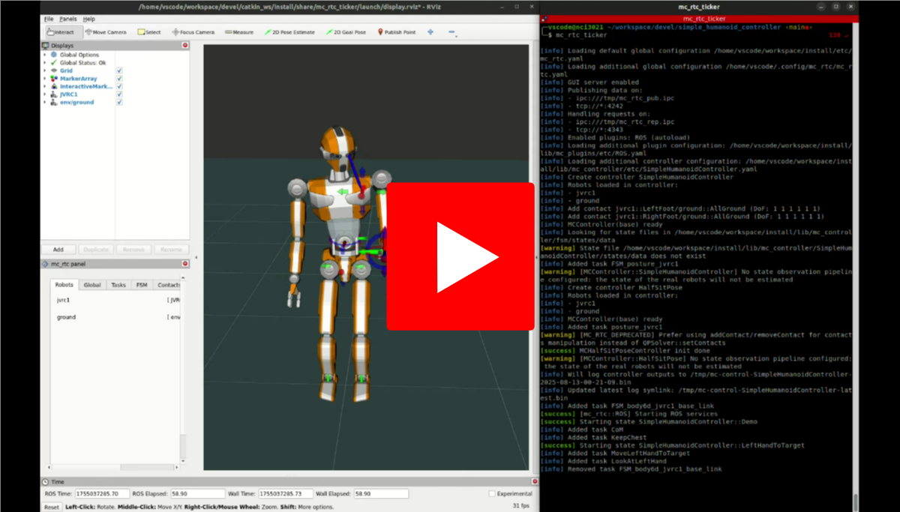

# Simple Humanoid Controller

This project implements a simple (FSM-based) controller for the **JVRC-1 humanoid robot** using the [mc\_rtc](https://jrl-umi3218.github.io/mc_rtc/) framework. It performs a predefined sequence of arm and gaze movements for demonstration and testing purposes.

---

## Overview

The controller continuously cycles through the following actions:

1. Move the **left hand** to a target pose, then return it to its initial pose.
2. Move the **right hand** to a target pose, then return it to its initial pose.
3. Move **both hands** to their target poses, then return them to their initial poses.

**Gaze behavior:**

* When a single hand is moving, the robot looks at that hand.
* When both hands are moving together, the robot looks straight ahead.

---

## Installation

### 1. Prepare the mc\_rtc development environment

Follow the [mc-rtc-superbuild devcontainer setup guide](https://github.com/mc-rtc/mc-rtc-superbuild/blob/main/doc/devcontainer.md) to set up the development environment.

### 2. Clone this repository into your superbuild `extensions` directory

```bash
mkdir -p <path>/mc-rtc-superbuild/extensions/local/
cd <path>/mc-rtc-superbuild/extensions/local/
git clone git@github.com:Ekanshh/simple_humanoid_controller_superbuild.git
```

### 3. Build the superbuild with the new extension

This will make `SimpleHumanoidController` available in your mc\_rtc installation.

### 4. Enable the controller in mc\_rtc configuration

Edit your mc\_rtc configuration file (Linux: `$HOME/.config/mc_rtc/mc_rtc.yaml`):

```yaml
MainRobot: JVRC1
Enabled:
  - SimpleHumanoidController
```

---

## Running the Controller

Open **two terminals** in the development container or on your system.

**Terminal 1 – Launch the display:**

```bash
ros2 launch mc_rtc_ticker display.launch
```

**Terminal 2 – Run the controller:**

```bash
mc_rtc_ticker
```

---

## Demo Video

<sub><em>The demo showcases the robot executing the controller sequence at 2× speed. Click to watch!</em></sub>

[](media/demo_2x.webm)

---

## Requirements

* [mc-rtc-superbuild](https://github.com/mc-rtc/mc-rtc-superbuild) (and dependencies)
* Tested on **Ubuntu 22.04 (Jammy)** using the official mc\_rtc devcontainer

---

## License

This project is licensed under the MIT License.

---
